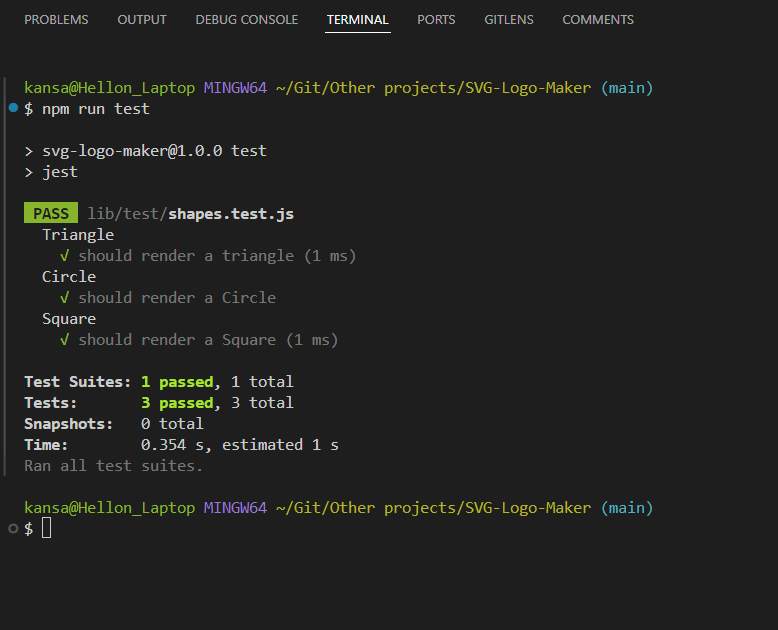

# SVG Logo Maker

## Description

This project will use Object Oriented Programming (OOP) to build the user an SVG Logo. The user will be asked several questions regarding the shape, color(s) and text to be used.

- My motivation was to create a JavaScript program that used libraries and OOP to easily create SVG logos.
- I built this project to easily create a simple SVG logo for my projects.
- This project solved the problem of spending lots of money to hire a graphic designer to create logos for projects.
- I learned how to utilize SVG (Scalable Vector Graphics) that will work with other web standards such as CSS, DOM, JS and others.  I also learned how to write code using Test Driven Development (TDD) to first fail the test, and then write just enough code that will pass, and then to continue to rewrite code and test(s) so that the final code is all around better and more fault tolerant.  

## Table of contents

* [Installation](#installation)
* [Usage](#usage)
* [Contribute](#contribute)
*  [Test](#test)
* [Questions](#questions)
* [License](#license)

## Installation

All you need to do is clone the repository from GitHub onto your computer. Once you open the root of the new folder, you can run `npm install` in the terminal. You are now set to run the actual program.

## Usage

After you have installed the npm, in the terminal type in `npm run test` and press enter. Then it will run the test and you should pass the unit level self-test. Then in the terminal on a new command line interface type `node index.js` and answer the question. When you get asked for a color you can enter either a hexadecimal number, such as #8E00FD, or the name of a color, such as, purple. Once the questions are answered you will receive a “Generated logo.svg!!!” message. Then copy the path of the `logo.svg` file into a browser and press enter. You should see the logo on the screen

## Contribute

If you would like to contribute to this project, please see below for my contact information.

## Test

Conduct the test, `npm run test`. The test should come back looking like this:

## Questions

My Github profile can be located at <https://github.com/Michael-Hellon/>

You can email me with any questions at <mwhellon@yahoo.com>

The demo video can be found at <https://youtu.be/B6AWscHJLP8>

## Credits

I completed this project myself and used MOD 10’s mini-project as a guideline for this project. I used several page from MDN regarding SVG’s.  SVG: Scalable Vector Graphics page: <https://developer.mozilla.org/en-US/docs/Web/SVG>

I searched google for the hexadecimal numbers for the colors.

## License

To read more about the MIT license, click here ==> [License: MIT](https://opensource.org/licenses/MIT).

